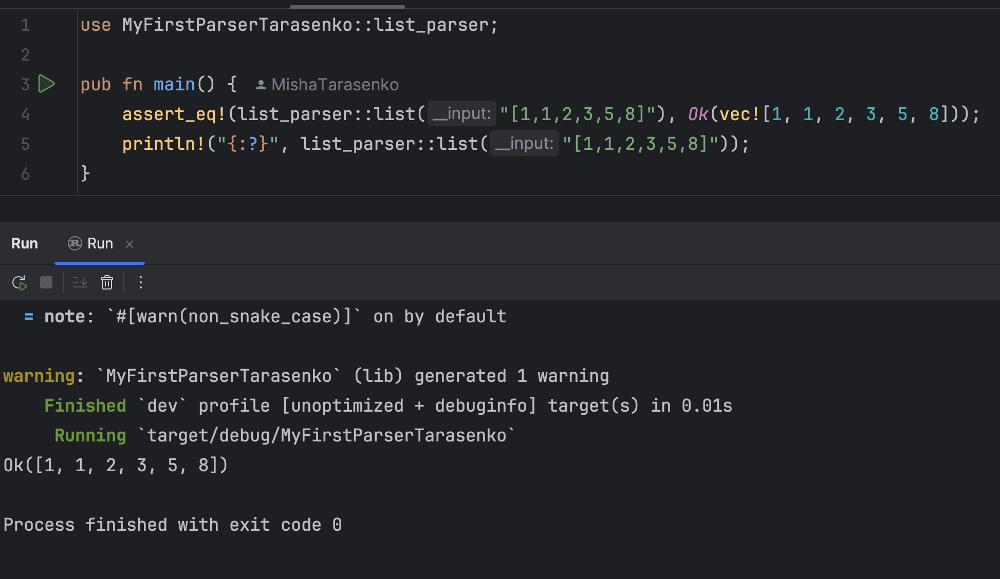

# my_first_parser
My Parser

Welcome to My Parser, an educational crate designed to help you parse lists of numbers in string format. If you're looking to learn how parsers work or need a simple tool to parse numbers, this crate is for you!

Description

This parser is meant for educational purposes, allowing you to parse a list of numbers given in string format like "[1, 1, 2, 3, 5, 8]" and convert it into a Vec<i32>. It's perfect for those who want to understand how parsing works in Rust.

Examples

Parsing a Valid List

You can use my_parser_striletska to parse a list of numbers:

```rust
use MyFirstParserTarasenko::list_parser;

pub fn main() {
    assert_eq!(list_parser::list("[1,1,2,3,5,8]"), Ok(vec![1, 1, 2, 3, 5, 8]));
    println!("{:?}", list_parser::list("[1,1,2,3,5,8]"));
}
```

